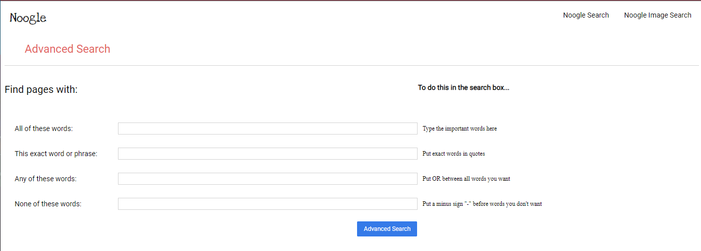

# _**Noogle Search**_

### ***Video Demo***: https://youtu.be/g8Bxvfdf0oQ

### *Description*:

Noogle search is a sample project created for Project 0 of CS50w, using HTML and CSS I was able to create a new front-end for a simple Google search (with a working "I'm feeling lucky button), Google image search and Google advanced search.

## ***Noogle Search***
This is the default page you'd start on, but on other sites you would click "**Noogle Search**". Using the text input bar provided at the middle of the screen the user is able to make a google search using google's search engine but with a front-end that I provided. Instead of using the standard font style of "Roboto" for the normal Google front-end I decided to opt for a creative design change in line with this project being my first HTML/CSS project and chose to use "Love ya like a sister" font style instead.
  

   

## ***Noogle Image Search***
Clicking "**Noogle Images**" at the top-right of the screen switches over to the Noogle Image Search, which is another front-end for google's image search wherein the user will provide another text input that would then use the input as a query for google's image search. Like Noogle Search I chose to change the font style again, and was able to tweak a couple things around to create a style similar to Google Image's logo but using text and CSS rather than image and CSS positioning for the word "Images".
  

   

## ***Noogle Advanced Search***
Clicking "**Noogle Advanced Search**" at the top-right of the screen will bring you to Noogle Advance Search, which takes multiple inputs being:

- "All these words"
- "This exact word or phrase"
- "Any of these words"
- "None of these words"

I also chose to try using a @Media query to recreate the effect that is presented on Google's own Advanced Search page.  

  

###### *This is all meant to be a recreation of Google's front-end for their search engine but not claiming to be anything more than a recreating.*